---
title       : Data processing and analysis with R at OECD
subtitle    : Scope for A/S Open Source Software in an International Organisation
author      : Bo Werth
job         : Statistician OECD STI/EAS
framework   : io2012        # {io2012, html5slides, shower, dzslides, ...}
highlighter : highlight.js  # {highlight.js, prettify, highlight}
hitheme     : tomorrow      # {arta, ascetic, brown_paper, dark, default, far, github, googlecode, hemisu-light, idea, ir_black, magula, monokai, pojoaque, school_book, solarized_dark, solarized_light, sunburst, tomorrow_night, vs, xcode, zenburn}
widgets     : []            # {mathjax, quiz, bootstrap}
mode        : selfcontained # {standalone, draft}
knit        : slidify::knit2slides
ext_widgets : {rCharts: [libraries/highcharts, libraries/nvd3]}

--- .class #id

## Disclaimer

The information contained in this presentation has not been reviewed by the Organisation and do not necessarily represent the official views of the Organisation or of the governments of its member countries.

--- .class #id

## About OECD

- "Conventional Wisdom Central" [krugman.blogs.nytimes.com](http://krugman.blogs.nytimes.com/2010/09/10/oops-at-the-oecd/)
- evidence-based reports for policy recommendation
- exchange platform for government officials
- directorates covering different aspects of the economy
 - education, employment, international trade, tax regulations, environment, financial sector, science and technology...
- expert group meetings take place twice per year
- considerable overall budget
- allocated to deliverables every 2 years
- relatively small IT budget (6-7%)

<p style="text-align:right"><a href="http://www.oecd.org"></a></p>

--- .class #id

## The six principals of open science

<p style="text-align:center"></p>

Source: [Wikipedia](http://en.wikipedia.org/wiki/Open_science)

--- .class #id

## Rogoff and Reinhart: Growth in a Time of Debt

<p style="text-align:left"></p>

When a country’s debt-to-GDP level gets above 90%, real GDP growth takes a big hit

[Businessweek](http://www.businessweek.com/articles/2013-04-18/faq-reinhart-rogoff-and-the-excel-error-that-changed-history): FAQ: Reinhart, Rogoff, and the Excel Error That Changed History

[The Atlantic](http://www.theatlantic.com/business/archive/2013/04/forget-excel-this-was-reinhart-and-rogoffs-biggest-mistake/275088/): Forget Excel: This Was Reinhart and Rogoff's Biggest Mistake

 Carmen M. Reinhart & Kenneth S. Rogoff, 2010. "Growth in a Time of Debt," American Economic Review, American Economic Association, vol. 100(2), pages 573-78, May.

--- .class #id

### Herndon, Ash, and Pollin

They replicate R&R's original work and make various corrections to a) methods and data choices and b) a "spreadsheet error," the latter where R&R appear to have left out some important data that has a big impact on their results.

<p style="text-align:left"></p>

Source: http://jaredbernsteinblog.com/not-to-pile-on-but-correcting-reinhart-and-rogoff/

--- .class #id

## Peer-review: Mail Avengers

A paper that largely consists of the words "Get me off your *** mailing list" repeated 863 times was accepted by a journal that claims to be peer reviewed.

<p style="text-align:center">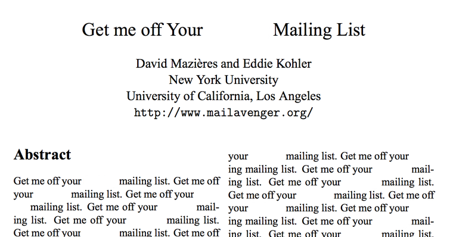</p>

Source: http://www.scs.stanford.edu/~dm/home/papers/remove.pdf

--- .class #id

### Mail Avengers: Figure 1
<p style="text-align:center">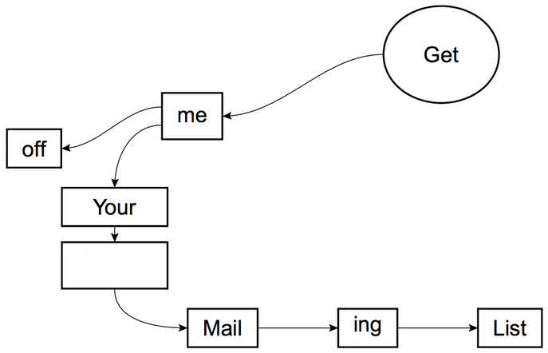</p>
Source: http://www.scs.stanford.edu/~dm/home/papers/remove.pdf

--- .class #id

### Mail Avengers: Figure 2

<p style="text-align:center">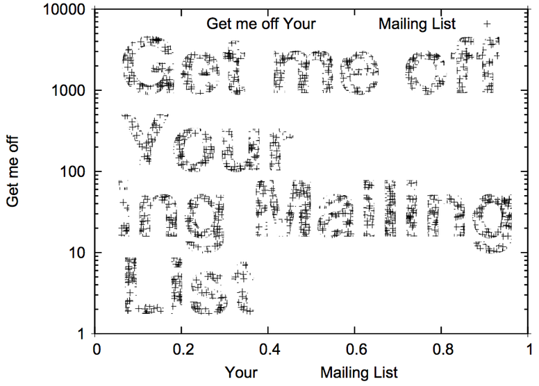</p>

Source: http://www.scs.stanford.edu/~dm/home/papers/remove.pdf

--- .class #id

## OECD Data Portal

Increase free accessibility to OECD's publications and data, while increasing dissemination and maintaining a sustainable and effective publishing operation

<p style="text-align:left">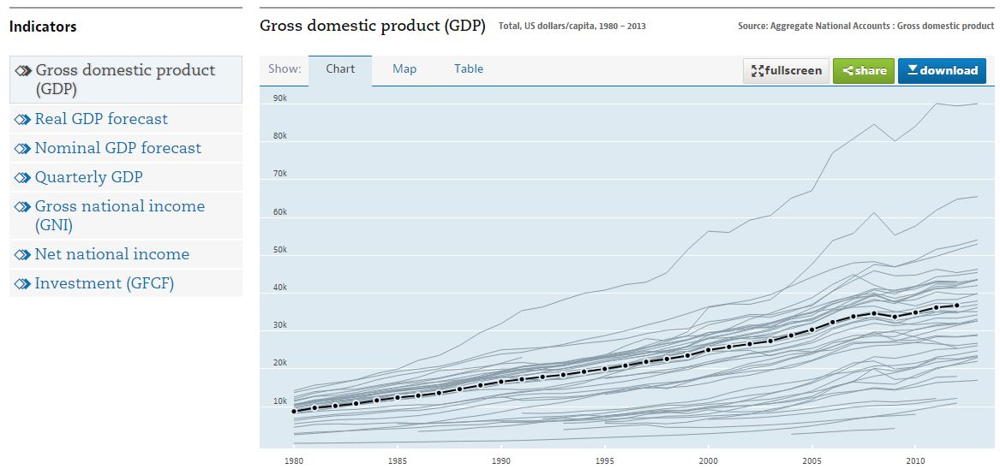</p>

http://data.oecd.org/

--- .class #id

## OECD Open Data

OpenDataAPI http://stats.oecd.org/opendataapi/

<p style="text-align:left">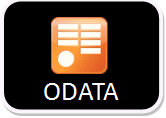</p>

Statistical Data and Metadata eXchange (SDMX)

<p style="text-align:left">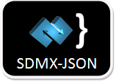</p>

<p style="text-align:left"></p>

Information about practical implementations: [http://sdmx.org/](http://sdmx.org/?page_id=14)

--- &twocol

## Publication Workflow

*** =left

Statisticians
- identifying and harmonising data
- graphics for analysis and publication

Analysts
- narrative for draft report

Senior Analysts
- editing for final report

Publishing and communications
- publishing on [OECD iLibrary](http://www.oecd-ilibrary.org/)

*** =right

<p style="text-align:center"></p>

<p style="text-align:center"></p>

<p style="text-align:center"></p>

<p style="text-align:center"></p>

--- .class #id

## Licensed A/S Software

- [EViews](http://www.eviews.com/): time-series oriented econometric analysis
- [FAME](http://fame.sungard.com): Forecasting Analysis and Modeling Environment
- [GAMS](http://www.gams.com/): high-level modeling system for mathematical programming and optimization
- [MATLAB](http://www.mathworks.com/products/matlab/): numerical computing environment for matrix manipulations
- [Prognoz](http://www.prognoz.com/): BI, analytics and visual discovery solutions
- [SAS](http://www.sas.com/): Business Analytics and Business Intelligence Software
- [Stata](http://www.stata.com/): Data Analysis and Statistical Software
- [Tableau](www.tableausoftware.com/): Business Intelligence and Analytics
- [TROLL](http://www.hendyplan.com/troll-software/): integrated software system for econometric modelling and statistical analysis

=> Large variety and high license cost

--- .class #id

## In-house developments

- [StatWorks](http://www.oecd.org/std/33869528.pdf): SQL-based information system for the management of statistical production data

<p style="text-align:center">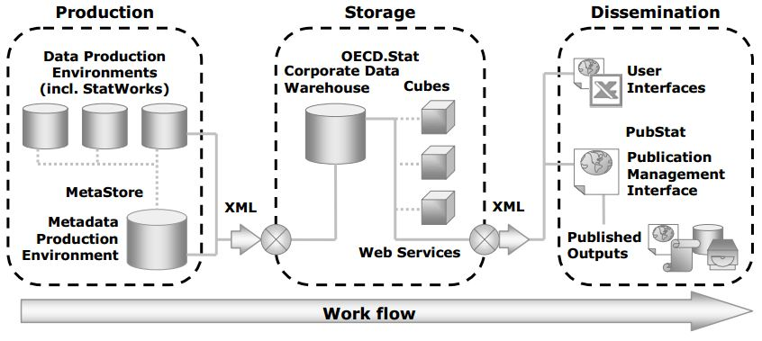</p>

- Implemented in 2004, maintained and enhanced by the IT department
- oriented at statistics, limited analytical functionality

--- .class #id

## Infrastructure with Open Source Software

### Requirements

- managed by staff with varying IT expertise
- interface with other languages and software
- front-end capacity
- flexible and intuitive chart libraries
- outputs for print and online publishing

### Candidates

<p style="text-align:left">
<a href="http://www.r-project.org/"></a>
<!--  -->
<a href="https://www.python.org/"></a>
<a href="http://julialang.org/"></a>
<!-- <a href="http://www.ruby-lang.org/"></a> -->
</p>

--- .class #id

## Front-end: web browser integration

### Motivation

- make usage as simple and intuitive as possible
- increase accessibility to developed procedures and back-ends
- ultimately consider public server hosting

### Candidates

<p style="text-align:left">
<a href="http://shiny.rstudio.com/"></a>
<a href="https://www.djangoproject.com/"></a>
<a href="http://rubyonrails.org/"></a>
</p>

--- .class #id

## Back-end: source code sharing

### Motivation

- benefit from OSS user community developments
- systematic user-driven enhancements
- co-operation and version control
- testing, transparency and issue tracking
- wiki documentation, jekyll project sites

### Github

<p style="text-align:center">
<a href="https://help.github.com/set-up-git-redirect">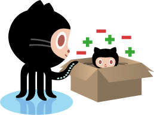</a>
<a href="https://help.github.com/create-a-repo"></a>
<a href="https://help.github.com/fork-a-repo"></a>
<a href="https://help.github.com/be-social"></a>
<a href="https://pages.github.com/"></a>
<a href="http://jekyllrb.com/"></a>
</p>

--- .class #id

## Reporting

### Requirements

- efficient templating syntax
- markdown support
- flexible outputs with [Pandoc](http://johnmacfarlane.net/pandoc/) universal document converter

### R Implementations

[rapport](http://rapport-package.info/): R templating system based on [pander](http://rapporter.github.io/pander/)

[ReporteRs](http://davidgohel.github.io/ReporteRs/index.html): generate Microsoft Word, Microsoft PowerPoint and HTML reports

<p style="text-align:left">


</p>

--- .class #id

## Visualisation

### R
- [ggplot2](http://ggplot2.org/): R plotting system
- [networkD3](http://christophergandrud.github.io/networkD3/): D3 network graphs with R htmlwidgets
- [rCharts](http://rcharts.io/): R interface to JavaScript libraries

### Python
- [Bokeh](http://bokeh.pydata.org/): Python interactive visualization library
- [d3py](https://github.com/mikedewar/d3py): Python interface to build interactive, javascript based plots
- [matplotlib](http://matplotlib.org/): Python 2D plotting library

### Julia
- [Gadfly](http://dcjones.github.io/Gadfly.jl/): plotting and visualization system for Julia

--- .class #id

## Online Publishing

[TERMINALFOUR](http://www.terminalfour.com/): current platform for website authoring

- websites must be tracked with their IDs
- media content items must be uploaded individually
- management of resources (js, css) requires admin intervention

### Alternative: Static Blog Generation

- file-based + database-free site generators (overview: [modernstatic](http://www.modernstatic.com/), [staticgen](https://www.staticgen.com/))
- e.g. jekyll + octopress (ruby), pelican (python)

<p style="text-align:left">
<!--  -->
<a href="http://jekyllrb.com/"></a>
<a href="http://octopress.org/"></a>
<a href="http://blog.getpelican.com/"></a>
</p>

--- .class #id

## Standards for OSS Usage

- appropriate licensing
- categorize into users and contributors
- formalize style, documentation and testing requirements
- specialised training offers (plot creation, function documentation, packaging, testing etc.)
- exchange about best practicies with national statistics offices
 - [Italian National Institute of Statistics (ISTAT)](http://en.istat.it/): Use of R in Business Surveys ([pdf](http://www.amstat.org/meetings/ices/2012/papers/302193.pdf))
 - [Statistics Netherlands (CBS)](http://www.cbs.nl/en-GB/menu/home/default.htm): The Introduction and Use of R Software ([pdf](http://www.amstat.org/meetings/ices/2012/papers/302187.pdf))
 - [UK Office for National Statistics (ONS)](http://www.ons.gov.uk/) Use of R in the UK ONS ([pdf](http://www.r-project.ro/workshop2014/papers/w2014_1.pdf))

--- .class #id

## SDMX Java library

Java functions developed by Attilio Mattioc at Bank of Italy 

<p style="text-align:left">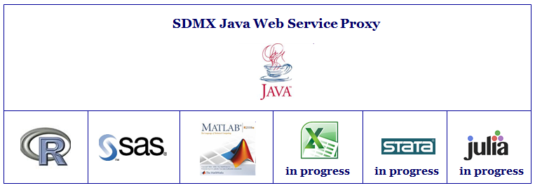</p>

- supported clients: ECB, Eurostat, IMF, ILO, OECD, INEGI (see list on [github](https://github.com/amattioc/SDMX/tree/master/JAVA/test/it/bankitalia/reri/sia/sdmx/client))
- R package with connector functions: [RJSDMX](https://github.com/amattioc/SDMX/wiki/RJSDMX:-Connector-for-R)

--- .class #id

## Cloud Hosting

### ICIO Foreign Demand Domestic Value Added

indicator calculation platform (shiny server + Azure): http://oecd-icio.cloudapp.net:3838/

- select dimensions
- subset data from multidimensional arrays
- perform calculations:

```{r, eval=FALSE}
  data.couX.indX <- data.conv1 * data.demand
  aaa <- xB %*% data.couX.indX
  aaa <- apply(aaa, 1, sum)
```

- aggregate and display results (table, barchart, map)

--- .class #id

### ICIO Foreign Demand Domestic: couD, couX, indX
<p style="text-align:center;">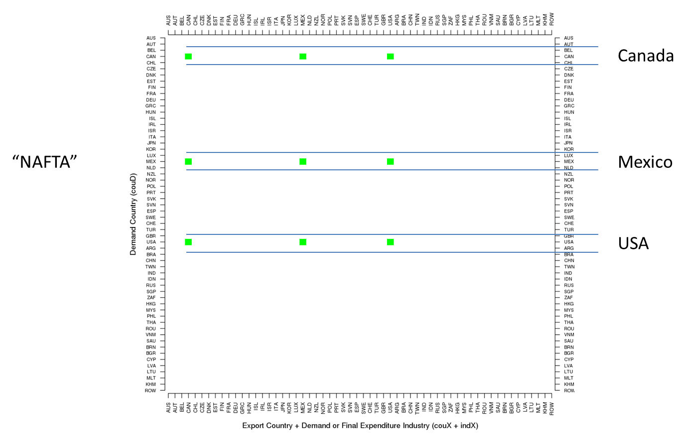</p>

--- .class #id

### ICIO Foreign Demand Domestic Value Added: calculation + aggregation
<p style="text-align:center;">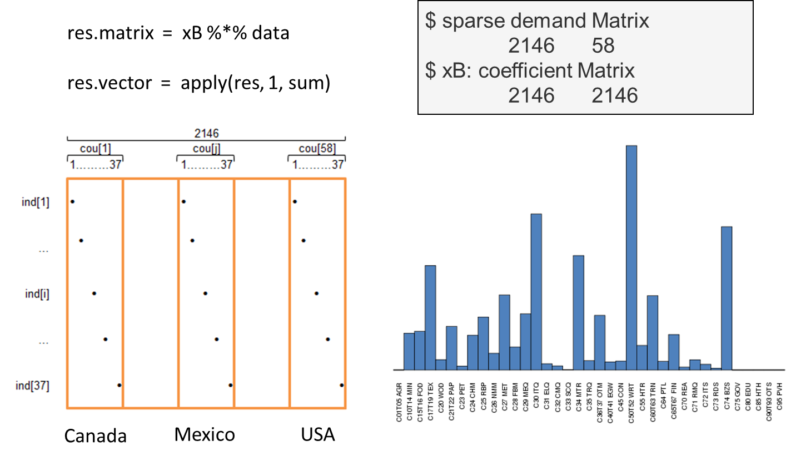</p>

--- .class #id

### ICIO Foreign Demand Domestic Value Added: aceEditor
<p style="text-align:center;">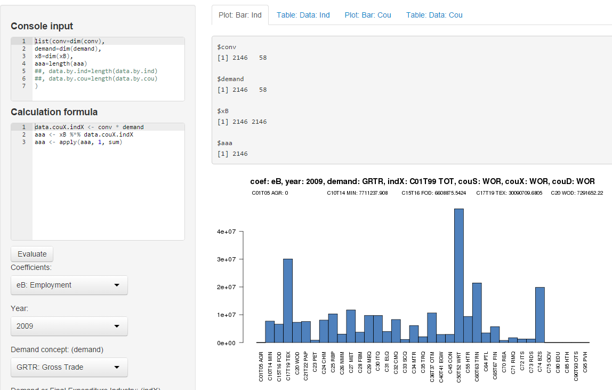</p>

--- .class #id

## References

- ProgrammableWeb link to [OECD Open Data API](http://www.programmableweb.com/api/oecd-open-data)
- [European Union Open Data Portal](https://open-data.europa.eu/en/data/publisher/estat)
- [rOpenSci](http://ropensci.org/): Transforming science through open data

### Contact

https://github.com/bowerth  
<bo.werth@gmail.com>  
<bo.werth@oecd.org>  
OECD Directorate for Science, Technology and Innovation  
2, rue André Pascal  
75775 Paris Cedex 16
